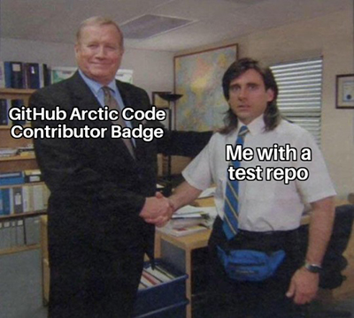

# 📝 Notepad 

A barebones notepad app using Sinatra and JavaScript, [try demo](https://notepad-demo.herokuapp.com) or

---

**DEVELOPMENT**

	git clone git@github.com:memiux/notepad.git
	make build
	make
	http://localhost:8000/

###### RESOURCES
* https://developer.mozilla.org/en-US/docs/Web/API/SubtleCrypto/
* https://github.com/mdn/dom-examples/tree/master/web-crypto

  

